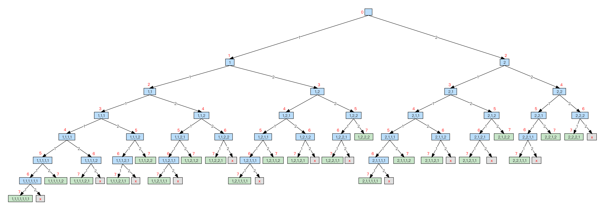
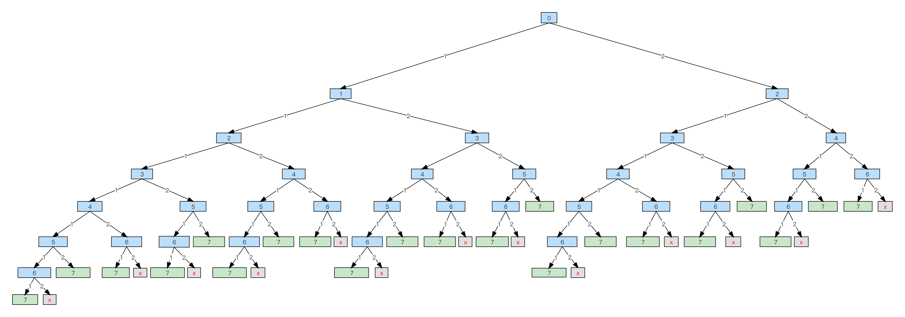
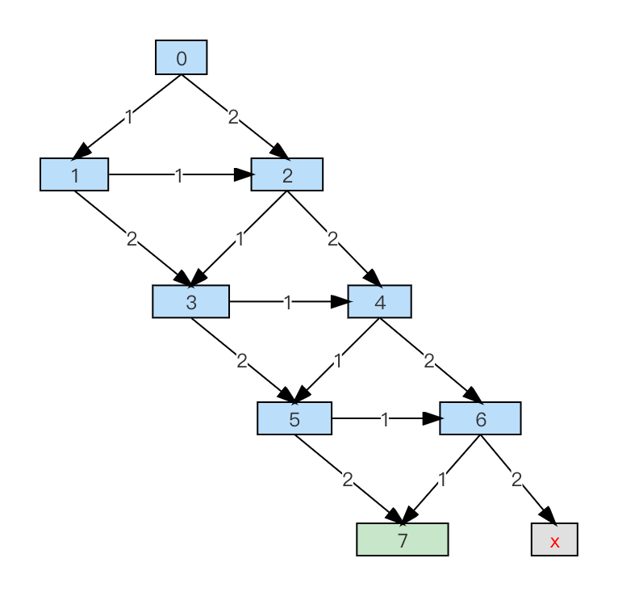
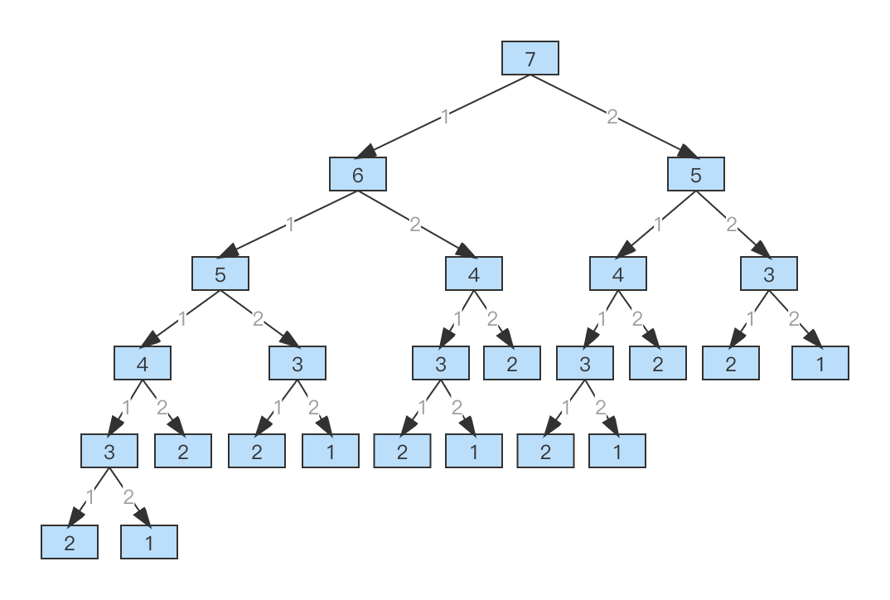
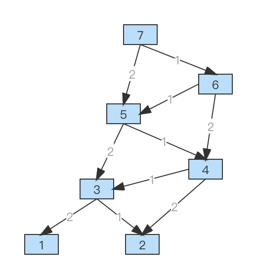

https://leetcode-cn.com/problems/climbing-stairs/

## 从暴力开始，逐步优化（ 一）

### 1. 暴力搜索

思路：确定每一步该怎么走

- 第 1 步：可以走 [1], [2]
- 第 2 步：可以走 [1], [2]
- 第 3 步：可以走 [1], [2]
- ...
- 第 i 步：可以走 [1], [2]

直到走的台阶数达到 n 阶。代码如下：

```js
/**
 * @param {number} n
 * @return {number}
 */
var climbStairs = function(n) {
  let ans = 0;

  // 递归：第i步怎么走
  let total = 0; // 状态空间：当前走过的台阶数
  const recur = function() {
    // 递归边界
    if (total > n) return; // 剪枝（跳过n的情况）
    // 若==n，则答案+1
    if (total === n) {
      ans++;
      return;
    }
    // 本层逻辑
    // N叉树：可以走1，也可以走2
    for (let i = 1; i <= 2; i++) {
      total = total + i;
      recur();
      total = total - i;
    }
  };

  recur();
  return ans;
};
```

> 运行结果：超出时间限制  
> 最后执行的输入：44

此思路是依次决定第 i 步怎么走，类似于“排列”。以 n=7 为例，其状态图如下：



其中，蓝框里是具体的走法（无重复的-因为是“排列”），蓝框旁边的红色数字表示当前走过的台阶总数（有相同的）。

虽然是“排列”的思路，但代码里没记录具体的走法，只记录了当前的总台阶数，所以真实的状态图如下：



可以很直观地看到有“重复”的状态。将相同的状态合并了之后，状态图简化成了：



这样，进一步的优化思路也就出来了。

### 2. 遍历有向无环图

广度优先遍历，代码如下：

```js
var climbStairs = function(n) {
  // i个台阶，共有 steps[i] 种走法
  let steps = new Array(n + 1).fill(0);

  // 广度优先遍历：队列+入口
  const queue = [];
  queue.push(0);
  // 开始遍历
  while (queue.length) {
    const front = queue.shift();
    steps[front]++; // 相应的走法+1
    // 如果台阶数==n，则找到一种
    if (front === n) {
      continue;
      // 如果台阶数<n，则继续走
    } else if (front < n) {
      queue.push(front + 1); // 再走1步
      queue.push(front + 2); // 再走2步
    }
  }
  return steps[n];
};
```

> 执行结果：超出时间限制  
> 最后执行的输入：35

呃...依然超时，而且效果似乎更差了。为什么？

虽然状态是合并了，但是代码依然遍历了“排列”里的每条边，所以还是超时（其本质和上面的深度递归遍历树是一样的）。

思考：代码为什么要遍历从 0-n 的每条路径？因为它是通过统计具体的走法来计算总数的。

题目里只要求计算有多少种走法，并没有要求列出每种走法的具体步骤。所以，能否通过记录每个结点的“走法总数”，从而避免遍历“边的排列”呢？

答案是肯定的。

### 3. 从 `[总台阶数, 具体走法]` → `[总台阶数, 走法总数]`

用“广度优先遍历+是否已访问”来实现代码，如下：

```js
var climbStairs = function(n) {
  // i个台阶，共有 steps[i] 种走法
  let steps = new Array(n + 1).fill(0);
  steps[0] = 1; // 0个台阶, 有1种走法
  steps[1] = 1; // 1个台阶, 有1种走法, [0,1]
  steps[2] = 2; // 2个台阶, 有2种走法, [0,1,1], [0,2]

  // 广度优先遍历：队列+入口
  const queue = [];
  queue.push(3); // 从3个台阶开始
  // 开始遍历
  while (queue.length) {
    const front = queue.shift();
    // 如果台阶数>n，则继续
    if (front > n) continue;
    // 如果该节点已访问，则继续
    if (steps[front]) continue;
    // 否则，处理本层逻辑
    steps[front] = steps[front - 1] + steps[front - 2]; // 计算本台阶数的走法总数：要么从1步的台阶上来，要么从2步的台阶上来
    queue.push(front + 1); // 继续，再走1步
    queue.push(front + 2); // 继续，再走2步
  }
  return steps[n];
};
```

> 执行结果：通过

改造成 for 迭代，代码如下：

```js
var climbStairs = function(n) {
  // i个台阶，共有 steps[i] 种走法
  let steps = new Array(n + 1).fill(0);
  steps[0] = 1; // 0个台阶, 有1种走法
  steps[1] = 1; // 1个台阶, 有1种走法, [0,1]
  steps[2] = 2; // 2个台阶, 有2种走法, [0,1,1], [0,2]

  for (let i = 3; i <= n; i++) {
    steps[i] = steps[i - 1] + steps[i - 2]; // 可以从走1个台阶来，也可以从走2个台阶来
  }
  return steps[n];
};
```

> 执行结果：通过

进一步优化：将空间复杂度从 O(n) 降到 O(1)，如下：

```js
var climbStairs = function(n) {
  let p1 = 0;
  let p2 = 1;
  let ans = 0;
  for (let i = 1; i <= n; i++) {
    ans = p1 + p2;
    p1 = p2;
    p2 = ans;
  }
  return ans;
};
```

> 执行结果：通过

## 从暴力开始，逐步优化（二）

### 1. 暴力搜索

思路：分治。将 n 阶的问题，划分成

- 先走 1 阶，再走 n-1 阶
- 先走 2 阶，再走 n-2 阶

这两个子问题，即 `f(n) = f(n-1) + f(n-2)`

```js
/**
 * @param {number} n
 * @return {number}
 */
var climbStairs = function(n) {
  if (n === 1) return 1;
  if (n === 2) return 2; // [1,1], [2]
  return climbStairs(n - 1) + climbStairs(n - 2);
};
```

> 运行结果：超出时间限制  
> 最后执行的输入：45

通过打印 log，可以很直观地看到都递归了谁，以及其中间状态如何。

继续以 n=7 为例，其状态图如下：



通过上图，可以很直观地看到，状态空间中有相同的状态。

如果将相同的状态合并成一个，那么上面的树形结构就会变成一张图，如下：



“将相同的状态合并成一个”正是针对暴力搜索的一个优化。

### 2. 记忆化搜索

记忆化搜索，就是将之前已经计算过的状态给存起来，等后面再用的时候，就可以直接取结果了，从而避免了不必要的递归下探，以此来提升算法性能。

```js
/**
 * @param {number} n
 * @return {number}
 */
var climbStairs = function(n) {
  // 存起来：当有 i 个台阶时，一共有 cache[i] 种不同的走法
  const cache = [0, 1, 2];
  // 递归-深度优先遍历
  const dfs = function(n) {
    // 优先取缓存
    if (cache[n]) return cache[n]; // 1 <= n
    // 若没有，再向下探寻
    let p1 = cache[n - 1] ? cache[n - 1] : dfs(n - 1); // 同理，先取缓存
    let p2 = cache[n - 2] ? cache[n - 2] : dfs(n - 2); // 同理，先取缓存
    // 把结果存起来
    cache[n] = p1 + p2;
    return cache[n];
  };
  return dfs(n);
};
```

> 执行结果：通过

将上面的递归展开成 for 循环，就是动态规划了。

### 3. 动态规划

```js
/**
 * @param {number} n
 * @return {number}
 */
var climbStairs = function(n) {
  // 存起来：当有 i 个台阶时，一共有 cache[i] 种不同的走法
  const cache = [0, 1, 2];

  for (let i = 3; i <= n; i++) cache[i] = cache[i - 1] + cache[i - 2];

  return cache[n];
};
```

进一步优化：将空间复杂度从 O(n) 变成 O(1)，如下：

```js
/**
 * @param {number} n
 * @return {number}
 */
var climbStairs = function(n) {
  let p1 = 0,
    p2 = 1;
  let ans = 0;
  for (let i = 1; i <= n; i++) {
    ans = p1 + p2;
    p1 = p2;
    p2 = ans;
  }
  return ans;
};
```

## 总结

同是暴力搜索，但是不同的思路会导向不同的优化。

暴力搜索的思路一是“排列”，它的每一步都是独立的但又彼此依赖，其整体才是最终的答案。针对思路一的优化，看起来是走了弯路，其实是被推倒重来了，因为“状态”这个本质已经变了。

暴力搜索的思路二是“分治”，它是将原问题划分成了“规模更小但是解题思路一致”的子问题。在这样的状态空间里，才有可能（自然而然地）出现重叠的（子）状态。

> 关键：分治

因为重叠的状态（结点），递归树变成了一张图（有向无环图）。在遍历图的时候，之前是一个简单的布尔数组 `visited[]`，现在换成了结点的“状态”信息，但它们的目的都是一样的——为了避免结点的重复访问。这，就是记忆化搜索。

> 数据结构：树 → 图  
> 图的遍历：`visited[]` → `state[node]` （结点是否已被访问）

将记忆化搜索（深度/广度优先遍历）展开成 for 循环，就是动态规划了。

在整个状态空间中的状态迁移，在图里是用有向边表示的，在动态规划里是用递推公式表示的。

> 核心概念：状态 + 状态空间
