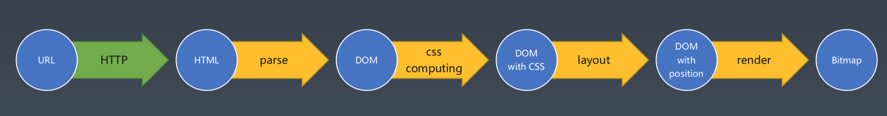
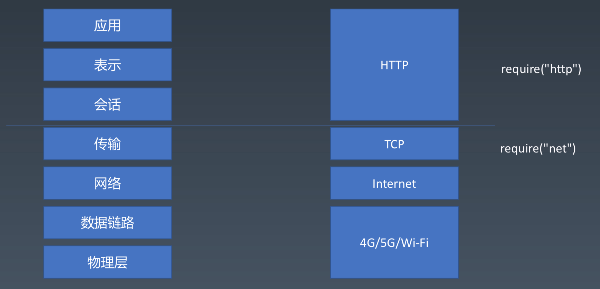

# 一、浏览器工作原理

> 基于 Node.js 环境，用 JavaScript 实现一个 Toy-Browser



1. URL `→ HTTP Request → HTTP Response`
2. HTML `→ HTML Parser`
3. DOM Tree `→ CSS Computing（将CSS选择器应用到DOM元素上）`
4. DOM with CSS `→ Layout`
5. DOM with position `→ Render`
6. Bitmap `传给显卡驱动设备 → 人眼可识别的光信号`

## 1. HTTP 解析

### ISO-OSI 七层网络模型



1. 4G/5G/Wi-Fi：对数据的准确传输，是点对点的传输（需要两个东西之间有一个直接的连接）
2. 网络层的流行协议 Internet（因特网） Protocol：即 IP
   - 传输数据的概念是一个一个`数据包`
   - 因特网协议是根据`IP地址`确定包是从哪到哪。IP 地址是 Internet 上设备的唯一标识
   - Node.js 底层调用了 C++的两个库`libnet/libpcap`。前者负责构造 IP 包并发送，后者负责从网卡抓所有的流经网卡的 IP 包
3. 传输协议：TCP/UDP
   - TCP, 对应在 Node.js 里，是包`net`
   - TCP 层传输的数据是`流`（没有明显的分割单位，只保证前后顺序是正确的）
   - 计算机的网卡是根据`端口`把接到的数据包分给各个应用的。TCP 协议是被计算机里的软件使用的，每个软件都会从网卡取数据，具体哪个数据分配给哪个软件
4. HTTP 层
   - 对应在 Node.js 里，是包`http`

> - 外网 Web，即常说的万维网
> - 内网 Intranet
> - 因特网 Internet

相对 TCP 这种全双工通道（你可以给我发，我也可以给你发，不存在啥优先关系），HTTP 是分客户端和服务端的：

- HTTP Request
- HTTP Response

在 Toy-Browser 里，是`require('net')`完成 TCP 层的数据发送和接收，需要我们自己完成 HTTP 请求和 HTTP 响应的解析。

HTTP 协议是文本型的协议，即协议里的所有内容都是字符串。

### HTTP Request

在客户端发起 HTTP Request。

```javascript
// client.js
let request = new Request({
  method: "POST", // HTTP层
  host: "127.0.0.1", // IP层
  port: "8888", // TCP层
  path: "/", // HTTP层
  headers: {
    // HTTP层
    ["X-Foo2"]: "customed"
  },
  body: {
    name: "Jack",
    age: 18
  }
});
let response = await request.send();
```

逻辑是：详见`util/HTTP/Request.js`文件

1. 自己构造 HTTP Request。在 Request 类的构造函数`constructor()`
   - 设置请求头的默认值
   - Content-Type 决定了 HTTP 请求的 body 的格式
2. 通过包`net`建立 TCP 连接，并监听其`data`事件接收数据。如下：

```javascript
connection.on("data", data => {
  console.log(data.toString());
});
```

接收到的数据（Buffer 类型）转成纯文本后，如下：

<pre>
HTTP/1.1 200 OK\r\n
Content-Type: text/html\r\n
Date: Tue, 21 Sep 2021 12:40:23 GMT\r\n
Connection: keep-alive\r\n
Transfer-Encoding: chunked\r\n
\r\n
fde\r\n
&lt;html lang="en"&gt;\n
...
...
Hello, World! 内容里有很多\n和空格
...
...
&lt;/html&gt;\r\n
0\r\n
\r\n
</pre>

> \r\n 和 \n 是为了方便“看”，自己加上去的
>
> - \r\n 是 TCP 数据流里的分隔符
> - \n 是 body 里自带的有效字符

说明：

- `fde`是 16 进制的，表示 body 的内容长度
  - 当 body 里含有中文时，一个中文的“长度”是 3
- 当 body 的内容解析完了，即`fde`变成了`0`，此时的字符是`>`

### HTTP Response

解析 TCP 传来的字符，一个一个解析。详见文件`util/HTTP/ResponseParser.js`和`util/HTTP/TrunkedBodyParser.js`。

1. 解析 HTTP Response 结构：状态行、响应头、body
2. 再同时接收 body 的内容，直到接收完

### 小结

相关文件的主要作用：

1. `client.js` 在客户端发起一个 HTTP 请求
2. `util/HTTP/Request.js` 手动构造 HTTP 请求，通过`net`包建立 TCP 连接，等数据回来
3. `util/HTTP/ResponseParser.js` 处理 TCP 传来的数据（即 HTTP Response 的字符串），以提取出来 HTTP Response 的状态码、响应头、body
4. `util/HTTP/TrunkedBodyParser.js` 重点处理 HTTP Response 的 body。怎么处理依赖 HTTP Response 头的`headers['Transfer-Encoding'] === 'chunked'`

状态机的应用：一个字符一个字符处理

1. 处理 TCP 返回的数据 → HTTP 状态行、响应头的键值对、body
2. 处理 HTTP Response 的 body 数据：一个一个字符接收，直到接收完。即把 body 里的数据处理到 length===0

## 2. HTML 和 CSS 解析

处理 response.body 里的字符串，返回 DOM 树。

### token 解析

一个字符一个字符处理，也是个状态机

- `[data]`状态自循环：只做一件事，把一个一个文本`{type: 'text', content: c}`传给 DOM 树的构造（构造 DOM 树时才会把 text 再拼起来）
- `[EOF]`则结束
- `[tagOpen]`状态：tag 不论多么复杂都当成一个 token 来处理了（内含 tagName 和 attributes）
  - 开始标签（含属性）
  - 结束标签
  - 自封闭标签（含属性）

在 token 解析时，遇到`type`是`text/startTag/endTag/EOF`的 token 时，就同时开始构造 DOM 树。

### 构建 DOM 树

入栈出栈，闭合标签+合并文本 → DOM 树

与此同时：

- 在遇到`</style>`时，解析 CSS 构造 CSS 的抽象语法树
  - 直接用现成的 CSS parser 库`css`，对 CSS 进行词法分析和语法分析
  - 在真实浏览器里时机比较复杂，但原则上是越早越好
- 在遇到开始标签时，对 DOM 中的元素应用 CSS 规则。详见下一步
  - 隐形的规则，可覆盖大部分情况
- 在遇到结束标签时，开始 flex 布局（详见下一节）

### 对 DOM 中的元素应用 CSS 规则

即计算 DOM 树中元素的 computed CSS，计算结果和在浏览器开发者工具的 style 选项卡里看到的一样。

注意：CSS 选择器从左到右匹配

- DOM 元素及其祖先元素们：当前元素+栈里的元素们逆序
- CSS 选择器的逆序

难点：找到与当前元素匹配的 CSS 规则 `(当前元素, 栈, CSSRules)`

- 先遍历 CSSRules（循环 1）
  - 再判断 rule 是否和当前元素匹配（循环 2 因为有以,分隔的选择器）
    - 再判断和祖先们是否有重叠（循环 DOM 元素的族谱）
    - 若成功匹配，则根据优先级决定是否覆盖
- 最终得到当前 DOM 元素的 Computed CSS

知识点：

1. `match(element, selector)`
2. `specificity(selector)`
   - 四元祖 [0,0, 0, 0]
   - 即 [inline, id, class, tag]
   - 优先级比较时，先从高位开始

> - string -> token, 词法分析
>   - token -> DOM 树, 语法分析
>     - DOM with computed CSS

### 小结

相关文件的主要作用：

1. `util/HTML/tokenization.js` token 解析，解析出 HTML 的开始/自闭合标签及其属性、结束标签、文本
2. `util/HTML/dom.js` token → 构造 DOM 树
3. `util/CSS/computing.js` 对 DOM 中的元素应用 CSS 规则

附. CSS Parser 解析的 CSS AST 抽象语法树的格式

```css
body {
  background-color: rgb(0, 0, 0);
  line-height: 1em;
}
ul,
li {
  margin: 0;
}
.cont6 li {
  width: 117px;
}

/* toy-browser 未绘制文本等，所以手动设置height以撑开元素 */
```

以上 CSS 会解析成：

```javascript
// ast.stylesheet.rules
[
  {
    type: "rule",
    selectors: ["body"],
    declarations: [
      {
        type: "declaration",
        property: "background-color",
        value: "rgb(0, 0, 0)",
        position: {
          start: {
            line: 3,
            column: 13
          },
          end: {
            line: 3,
            column: 43
          }
        }
      },
      {
        type: "declaration",
        property: "line-height",
        value: "1em",
        position: {
          start: {
            line: 4,
            column: 13
          },
          end: {
            line: 4,
            column: 29
          }
        }
      }
    ],
    position: {
      start: {
        line: 2,
        column: 9
      },
      end: {
        line: 5,
        column: 10
      }
    }
  },
  {
    type: "rule",
    selectors: ["ul", "li"],
    declarations: [
      {
        type: "declaration",
        property: "margin",
        value: "0",
        position: {
          start: {
            line: 9,
            column: 13
          },
          end: {
            line: 9,
            column: 22
          }
        }
      }
    ],
    position: {
      start: {
        line: 7,
        column: 9
      },
      end: {
        line: 11,
        column: 10
      }
    }
  },
  {
    type: "rule",
    selectors: [".cont6 li"],
    declarations: [
      {
        type: "declaration",
        property: "width",
        value: "117px",
        position: {
          start: {
            line: 95,
            column: 13
          },
          end: {
            line: 95,
            column: 25
          }
        }
      }
    ],
    position: {
      start: {
        line: 94,
        column: 9
      },
      end: {
        line: 98,
        column: 10
      }
    }
  },
  {
    type: "comment",
    comment: " toy-browser 未绘制文本等，所以手动设置height以撑开元素 ",
    position: {
      start: {
        line: 100,
        column: 9
      },
      end: {
        line: 100,
        column: 51
      }
    }
  }
];
```

说明：

1. 后代选择器，会解析成 `selectors: [".cont6 li"]`，即一个规则
2. 以,分隔的选择器，会解析成 `selectors: ["ul", "li"]`，即多个选择器
3. 注释的话，`type: "comment"`

## 3. 布局和渲染

1. 布局：只简单处理了 flex 布局，详见`util/Layout/layout.js`文件
   - 若父元素设置了尺寸，则由各个 flex 相关的属性分配其空间给子元素们
   - 若父元素没有设置尺寸，则由子元素们撑开
2. 渲染：画在了图片上，详见`util/Render/render.js`
   - 调用了个现成的库`images`

在 Toy-Browser 里，布局和渲染的时机分别是：

1. 布局的时机，是在构建 DOM 树的过程中
2. 渲染的时机，是在 DOM 树构建完毕之后，在`client.js`里递归渲染的

---

# 二、状态机

> “有限”状态“机”处理“字符串”

1. 每一个状态都是一个机器
   - 在每一个机器里，我们都可以做计算+存储+输出等
   - 所有的机器接收的输入是一致的
   - 状态机的每一个机器本身，是没有状态的
     - 如果我们用函数来表示的话，它应该是纯函数（无副作用）
     - 我们可以往外写，但不能从外表再读变量进来了
2. 每一个机器都必须知道下一个状态
   - 每个机器都有确定的下一个状态 `Moore`
   - 每个机器根据输入决定下一个状态 `Mealy`

实践：有限状态机的应用

1. 处理 TCP 返回的数据 → HTTP 状态行、响应头的键值对、body
2. 处理 HTTP Response 的 body 数据：一个一个字符接收，直到接收完。即把 body 里的数据处理到 length===0
3. HTML 解析，生成各个 token：开始/自闭合标签及其属性、结束标签、文本
