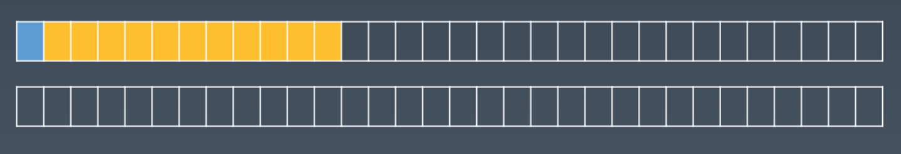
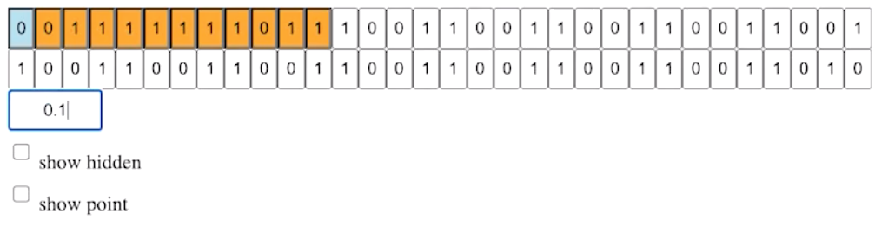

运行时：类型+执行上下文

# Number

在计算机编程语言中，类型都有它严格的定义，一直到 bit 级别。JS 遵循的是 IEEE 的 754 版本，双精度浮点数，64 bits，即 8 bytes。

Number 类型默认就是“浮点数”表示法。

IEEE 754 Double Float, 64 bits

- Sign (1 bit) 符号位 `0正1负`
- Exponent (11 bits) 指数位 `表示2的多少次方`
  - 指数位也需要符号位，因为要表示小数
  - 但没专门设置指数位的符号位，替代方案是：在橙色的基础上减去指定的值，就是它的指数的系数了
- Fraction (52 bits) `具体数值/有效数字/有效位`
  - 有效位的开头一定是 1，所以就省略了
  - 小数点是从指数位算出来的

> 省略有效位的 1 的逻辑：
>
> - 有效位若以 0 开头，那可以用指数位来表示。排除了 0 之后，有效位的开头一定是 1（既然一定是 1，那就省略了）
> - 有效位若以 1 开头，eg.0.1 有效数字是从 1 开始的

eg.双精度浮点数在内存中的表示（将其拆解成 bit 表示）
| 数字 | 真实内存 | 显示省略的有效位 | 显示由指数位算出来的小数点 |
| ---- | ------------------- | ----------------------- | ---------------------- |
| -2 |  | |
| -3 |  | |
| -4 |  | |
| -7 |  | |
| -11 |  |  |
| 0.1 |  |  |
| 0.5 | |  |
| 2 |  |  |  |
| 3 | |  |
| 7 |  | |  |

基于 JS 里 Number 的表示法，就可以解释很多现象。比如 0.1 + 0.2 为什么不等于 0.3？两个误差（十进制转二进制）相加->共 3 次误差（若方向相同还好，若方向不同）。

在所有的浮点数里都会有这个误差，所以，在需要高精度的场景里（涉及到钱）建议不要用浮点数。可以用整数，在显示之前给它加上小数点。

# String

字符串，字符集

### 字符集

- ASCII：最早在计算机中出现的，127 个（可追溯到打字机时代）
  - 很多其它字符集都会兼容 ASCII 的编码方式
- Unicode：现行标准，也是事实标准
  - 它兼容了各国的字符，数量巨大，目前超过 10 万了
- UCS
  - 和 Unicode 差不多，它是另一个标准化组织
  - 它相当于 Unicode 2.0（是一个中间结果）
- GB 国标，先后出现了三个版本，如下
  - GB2312 （它和 Unicode 不兼容，是中国的国家标准）
  - GBK(GB13000) （把汉字处理得非常好，但基本不包含其他国家的文字）
  - GB18030
- ISO-8859 它是一堆字符集（欧洲各国-1 -2 等）
- BIG5 大五码 台湾的繁体中文标准

JS 是采用的 Unicode 字符集。

通常情况，不同的字符集是不兼容的，即相同的码点对应的不同的字符。了解了字符集和码点，再来看编码。

### UTF 编码

Unicode 字符集会遵循一种 UTF 编码的格式。UTF 编码就是通过合理安排计算机中的存储空间，来保存 Unicode 里的数字。

介绍两种比较重要的编码 UTF-8, UTF-16。UTF-8 是兼容 ASCII 的（可以很好的兼容老旧系统）。

这里需要注意的是：当超过一个编码单元时，UTF-8 和 UTF-16 是如何处理的。

#### UTF-8

当 UTF-8 需要用多个字节来表示一个字符的时候，就用控制位来处理编码格式：如果字节是以 1 开头的，那么该字节里是包含控制位的，有几个连续的 1 就表示要占几个字节。
eg. 汉字”一“，码点是 19968，二进制表示是 0b 100 1110 0000 0000（有效位数是 15 位，控制位如黄色部分-共 3 字节）

#### UTF-16

UTF-16 在某个时间点来看空间足够大了（65536），之后发生了 Unicode 组织和 UCS 负责的组织合并的事件。UTF-16 比 UCS 编码格式要晚，它规定了当超出 16-bits 时怎么存储（而更早的 UCS 是没有考虑的，它默认 16-bit 存储字符足够了）。

UTF-16 的处理办法是：规定二进制以 110110 和 110111 开头的字符段，必须是空出来的，所以它两就变成了有效的控制位标志，一旦出现了它们就说明要用 4 个字节来表示一个字符。

> 110110 和 110111 没啥规律，就是规定的

eg.表情龙头

### 小结

后来出的专门针对 code point 的 API，就是专门用来处理超出基本平面（0000~FFFF）的字符，传统用的 charAt() charCodeAt() length 在处理超出的这些字符的时候都是失效的。

我们的 JS 号称是针对 char，其实是针对 UTF-16 的一个资源，所以我们要知道 JS 的 string 里存的都是 UTF-16 编码的，我们所熟悉的 charAt() 等 API 并不是针对字符的。

关于上面提到的字符、字符集、码点、编码（编码形式\~代码单元，编码方案\~具体到 bytes 和 bits），可查看文章[《Unicode 字符编码模型》](https://github.com/anjia/blog/issues/86)。
