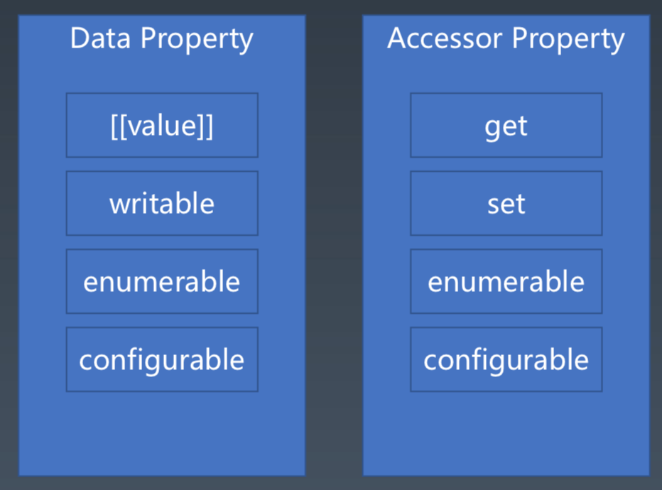

C++ 和 Java 的面向对象太成功了，几乎把面向对象的话语权都拿走了。

Object 翻译“世间万物/所有物品的统称”， ~~对象~~/物件

> target 翻译成“对象”更贴切  
> target 目前被翻译成了“目标”

当我们在计算机中描述三只鱼时，必须把相同的数据存储三份。  
一个对象必须是一个可修改的、有状态变化的东西。

我们把“具备什么特征”的东西抽象成一个对象：三合一，即唯一标识+状态+行为

- 唯一标识性（内存里的存储地址）
- 用状态来描述对象
- 状态的改变就是行为

# 描述对象的两种方式

## Class 类

类是一种常见的描述对象的方式。
两个主要流派：

- 归类：多继承是非常自然的事情（eg.C++）
- 分类：则是单继承结构，且会有一个基类 Object（eg.C#, Java）
  - 用接口的方式弥补它不能多继承的抽象能力的不足
  - 简化了编程的思维

## Prototype 原型

今天看面向对象，会发现面向对象已经停止发展了。
在 JS 的初期，是选择了一个比较小众的面向对象的流派。

> JS 最早的规划是 scheme（一个经典的函数式编程语言）+ Prototype
> 但又长的很像 Java（公司的不可抗力） 的语言

描述对象的思路是（原型的思想）：

- 选一只典型的鱼，不大不小不胖不瘦
  - 对于其他鱼，就描述它和“典型的鱼”不同的地方就是了
- 选一只典型的羊，不大不小不胖不瘦
  - 对于其他羊，就描述它和原型羊的区别就是了（一样的就不再描述了）
- 鱼和羊的共性，就再抽象一个动物
  - 可能是老虎

原型是一种更接近人类原 始认知的描述对象的方法。
我们并不试图做严谨的分类，而是采用“相似”这样的方式去描述对象。
任何对象仅仅需要描述它自己与原型的区别即可。

原型同样有 class based 的问题，
我们要不要有最终的原型——Object 的原型。
有的语言有，有的没有。

- ES3.0 时代，是创建不出来非 Object.prototype 的原型的
- 基于原型的方式，Object.prototype 再往上它最终有一个叫 Nihilo 对象（其实就是 Null）
  - 若想给它一个原型的话，就给它一个 Null

抽象方式可能不用那么严谨，只要这两个东西有共性，就可以搞一个原型上去。

JS 是引用型的原型继承，就是你如果改了原型里面的值，那么继承了这个原型的对象它就都变了（这也是一个比较神奇的语法现象）。

JS 里的`new Function()`的这种方式只是当时的一个权宜之计（写法上像类但是实现上又是原型，类做的不彻底），今天已经有了更好的设施`class`，如果想要使用基于类的语法，不要犹豫，请使用`class`。

> new Function 的方式，可以彻底废弃掉

eg.狗咬人，“咬”这个行为该如何使用对象抽象?

```js
// 这是不对的
class Dog {
  bite(human) {
    //......
  }
}
```

直觉上会觉得越接近自然语言越好
但其实面向对象的方法是有讲究的：“行为”会导致对象“状态”的变化

```js
class Human {
  hurt(damage) {
    //......
  }
}
```

我们不应该受到自然语言描述的干扰。
在设计对象的状态和行为时，我们总是遵循“行为改变状态”的原则。

> 在设计/理解对象做抽象时的本质问题
> 最好跟实际开发联系到一起，那么我们的抽象水平肯定会提高的

# JS 里的 Object

JS 里的对象是典型的基于原型的对象体系。
它的对象设计比较简单，就两件事：

- Property：一个对象就是 Property 的集合，既有状态又有行为
  - JS 里行为和状态没有特别明确的区分，function 也可以视为一种数据（这算是函数式语言的特性）
- Prototype
  - 唯一特殊的地方就是每个对象上都要一个原型
  - 原型会指向另一个对象
  - 这是非常典型的一个引用型原型的对象的特点

> 这里的对象指普通对象，即用户自己创建的对象（不包括内置对象/宿主环境提供的对象）

## Property 属性

kv 对

- Key: String, Symbol
  - 这里的 Symbol 是专门用来做 Object 的 key 的对象，和语法分析里提到的 Symbol 不一样
  - 任意的两个 Symbol 不会相等（类似 guid 的东西）
- Value: Data, Accessor(getter+setter)



- enumerable 会影响 for...in 的行为
- configurable 这个对象能不能改变它的这些特征
  - 若设置成 false，则是一次性的。再没有其它方法把它设置成 true 了（它也管自己）

JavaScript 用属性来统一抽象对象状态和行为。
一般来说，数据属性用于描述状态，访问器属性则用于描述行为。
数据属性中如果存储函数，也可以用于描述行为。

## Prototype 原型

它只是一个普通的对象的引用（并没有产生什么特殊的效果）。
真正的效果是：当属性访问时

当我们访问属性时，如果当前对象没有，则会沿着原型找原型对象是否有此名称的属性，而原型对象还可能有原型，因此，会有“原型链”这一说法。这一算法保证了，每个对象只需要描述自己和原型的区别即可。

> “原型链” 在标准里是没有明确的说什么 prototype chain 之类的。但确实是个链式行为。所以访问属性的时候，开销可能会比我们想象中的大。

是没有办法删除属性的，可以指定一个 Undefined 的属性给它覆盖掉。
_原型继承的特点_

有 4 组对对象进行操作的 API/语法：

1. 对象的基本操作：可以对单个对象进行加工
   - `{}` / `Object.defineProperty`
   - `.` / `[]`
2. 基于原型的编程范式：若想做纯粹的基于原型的面向对象的编程（就纯粹的对象和对象之间的关系）
   - Object.create
   - Object.setPrototypeOf
   - Object.getPrototypeOf
3. 基于类的编程范式：语法和语义上都是基于 class 的，运行时是落到原型体系上的
   - `new` / `class` / `extends`
4. 用 new 函数的方式去创建对象（ES5.0 之前）：有点像基于类但又不是（必须要理解基于类的语法表象，又理解基于 prototype 的运行时）`不推荐使用-因为算是已经过时了的语言特性`
   - `new` / `function` / `prototype`

2 和 3 是互相独立，相互并行的，只是最终在运行时是有原型体系去实现的。

若不纠结于细节，那可以认为现有的 class 语法是可以完全当做基于类的面向对象的语言去理解的。它有单继承, new, class。有了 class 基本上没有什么坑了。

# 更多

## Function Object 函数对象

> 多了个[[call]]行为，私有的。（它大概率是个 c++代码。JS 是脚本语言，它会有个宿主，会执行 call）

前面讲述了 JavaScript 中的一般对象。但 JavaScript 中还有一些特殊的对象，比如函数对象。

除了一般对象的属性和原型，函数对象还有一个行为[[call]]。
我们用 JavaScript 中的 function 关键字、箭头运算符或者 Function 构造器创建的对象，会有[[call]]这个行为。

我们用类似 f() 这样的语法把对象当做函数调用时，会访问到[[call]] 这个行为。如果对应的对象没有[[call]]行为， 则会报错。

## Special Object 特殊对象

JS 中有很多的内置对象，都有特殊的行为, 它们都脱离了上面讲的普通对象的一种模式。比如:

- 数组的 length
- typed array 的 buffer
- Object.prototype 我们没法再给他添加一个原型了（也算是特殊行为）


思考：还有哪些对象有特殊行为？不能用 property 和 prototype 来解释的行为都算

## Host Object 宿主对象

它同样可以有 [[call]] 和 [[construct]] 行为。

```js
foo() = 2; // 从语法上允许出现在等号左边，它其实是返回一个引用。（但目前还没见宿主这么干的）
delete x;
```
