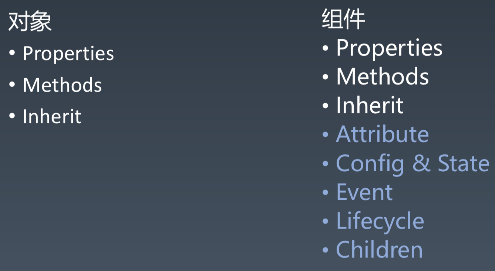
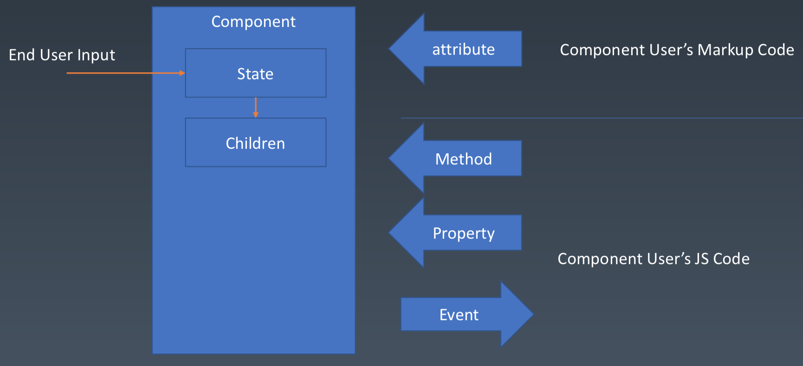
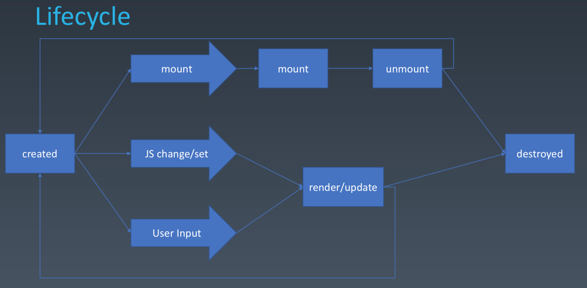

前端架构：

1. 组件化（复用）
2. 架构模式（MVC/MVVM，前端和数据逻辑层）

# 组件：基本概念、基本组成部分

- 组件：UI 强相关，可认为是特殊的模块和对象。可以以树形结构来进行组合、有模板化配置能力
- 模块化
- 对象

组件和对象：



组件：



|           | Markup set | JS set | JS change | User Input Change |
| --------- | ---------- | ------ | --------- | ----------------- |
| property  | ❌         | ✔️     | ✔️        | ？                |
| attribute | ️✔️        | ✔️     | ✔️        | ？                |
| state     | ❌         | ❌     | ❌        | ✔️                |
| config    | ️ ❌       | ✔️     | ❌        | ❌                |

config 是一次性的，不可更改。

## Attribute 和 Property

- Attribute 强调描述性
- Property 强调从属关系

HTML 就是典型的 attribute 和 property 不等效的系统。

```js
//Attribute:
<my-component attribute="v" /> myComponent.getAttribute('a');
myComponent.setAttribute('a', 'value');

//Property:
myComponent.a = 'value';
```

除了“写法”不同之外，“行为”也有区别。

eg1.名字不一样：`class` 和 `className`

```html
<div class="cls1 cls2"></div>
<script>
  var div = document.getElementByTagName("div");
  div.className; // cls1 cls2
</script>
```

> 早期的 HTML 是不允许关键字做属性名的

eg2.格式不同：一个是字符串，一个是语义化的对象

```html
<div class="cls1 cls2" style="color:blue"></div>
<script>
  var div = document.getElementByTagName("div");
  div.style; // 对象
</script>
```

eg3.`href`属性：虽会同时变，但取出来的内容稍有差异

```html
<a href="//xxx.com" ></div>
<script>
var a = document.getElementByTagName('a');
a.href // “http://xxx.com”，这个 URL 是 resolve 过的结果，会自动补齐协议
a.getAttribute(‘href’) // “//xxx.com”，跟 HTML 代码中完全一致
</script>
```

eg4.input 的 value：attribute 相当于 property 的默认值

```html
<input value="cute" />
<script>
  var input = document.getElementByTagName('input'); // 若 property 没有设置， 则结果是 attribute
  input.value // cute
  input.getAttribute('value'); // cute
  input.value = 'hello'; // 若 value 属性已经设置，则 attribute 不变，property 变化，元素上实际的效果是 property 优先
  input.value // hello
  input.getAttribute(‘value’); // cute
</script>
```

## 生命周期



- mount: 组件被创建了之后显示出来，挂载在屏幕上，即放在 DOM 树上

## Children

Children 是构建`组件树`的一个最重要的特性。

- Content 型 Children
- Template 型 Children

```html
<my-button>{{title}}</my-button>

<my-list>
  <li>{{title}}</li>
</my-list>
```

# 两种 Markup 建立组件的风格

1. 基于 JSX （跟 React 一样）
2. 基于标记语言的 Parser（类似 Vue）

## JSX

> JSX 早期是一个纯粹的语言扩展，也可以被其它组件体系使用。
> 甚至我们也可以把它单纯地用作创建 HTML 标签的快捷方式来使用

JSX 相当于纯粹在语法上的一种快捷方式。
可以让 JSX 和 React 之间没有任何联系。

## Parser
